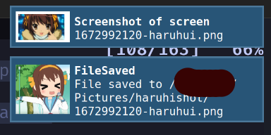

# haruhishot

It is a screenshot tool for wlroots based compositors such as sway and river written in Rust, with wayland-rs


## How to build

dependiences: `wayland` , `wlroots` , `rust` and `meson`

You can just run `cargo run`

If you want to package it , you can use `meson.build`

```bash
  meson setup \
    -Dprefix=/usr \
    -Dbuildtype=release \
    -Denable-notify=true \ # it is a feature of notify, can set it to false
    -Denable-sway=true \ # it is a feature of notify, can set it to false
    -Ddesktop-entry=true \ # it will install a desktop entry, can set it to false
    build
  ninja -C build
```

## Installation

[](https://repology.org/project/haruhishot/versions)

## Thanks to wayshot

## Use example

Fullscreen ~~(No, just the first screen, just because I am not familar with image.rs)~~ Finished fullscreen, just compile two images together

```
haruhishot -G --stdout | wl-copy
```

or

```
haruhishot --global --stdout > suzumiya.png
```

Pick with Region

```
haruhishot -S (slurp -d) --stdout | wl-copy
```

or

```
haruhishot --slurp (slurp -d) --stdout | wl-copy
```

Get Lists

```
haruhishot -L
```

or
```
haruhishot --list
```

Shot one screen

```
haruhishot -O DP-2 --stdout > test.png
```

or

```
haruhishot --output DP-2 --stdout > test.png
```

Get Color

```
haruhishot -C (slurp -p)
```

or

```
haruhishot --color (slurp -p)
```

if enable swayipc, then

```
haruhishot --window
```

hover on the window and press ese, then shot the window

## Features

### Notify Message



## TODO

* I want to add a slint fontend
* ~~Real Fullscreen shot~~
* In the code of wayshot, it seems need to make change if meet some format, but it works well on my computer, so..

## Thanks to the help of developers in Smithay
